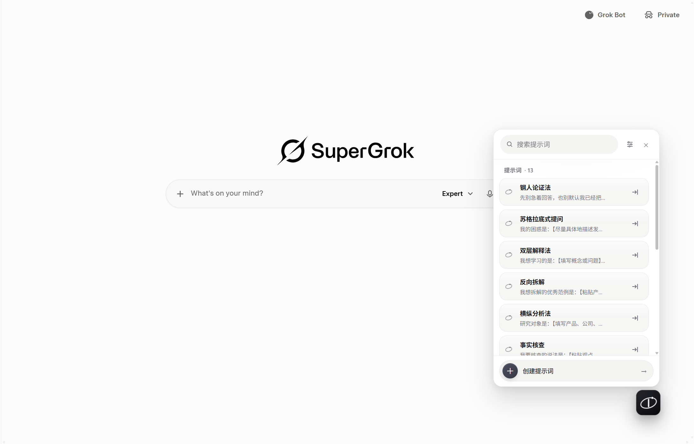
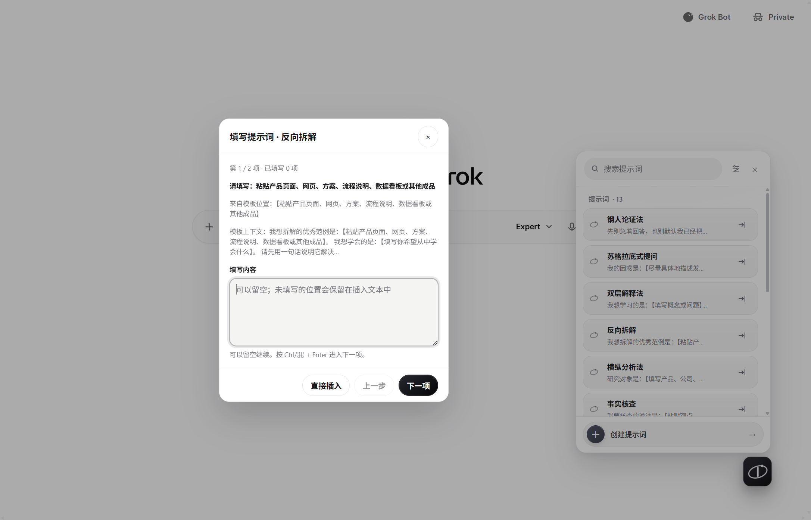

<div align="center">
  
  <h1>Grok 提示词助手</h1>
  <p>在 Grok 网页版集中管理常用提示词，一键插入，并按模板逐项填写需要替换的内容。</p>
  <p><strong>本地存储 · 零运行依赖 · 日常不联网 · 不自动发送</strong></p>
</div>



<p align="center"><sub>Steel Mist（钢雾）界面：提示词面板、搜索、可拖动浮动入口与 Grok 输入框原生集成。</sub></p>

## 它解决什么问题

反复复制长提示词时，真正麻烦的往往不是粘贴，而是每次都要找到并替换其中的“主题”“对象”或“要求”。Grok 提示词助手把常用模板保存在浏览器本地；点击词条后，模板中的 `【…】` 会按首次出现顺序进入填写向导，全部处理完再一次插入 Grok 输入框。

本项目基于 Issac Smit 的 [Prompt Helper Extension for ChatGPT](https://github.com/issacsmit/Prompt_Helper_Extension_for_ChatGPT) 改造，目标站点是 grok.com。除站点适配外，还加入了通用槽位填写向导、直接插入入口、搜索排序与 Steel Mist 视觉系统。

## 特性

- Steel Mist（钢雾）界面以克制的浮动入口和紧凑面板管理提示词
- 浮动入口一键唤出提示词面板，默认位于网页右下角
- 支持按名称和正文即时搜索，标题命中优先显示
- 在当前光标位置插入提示词，不覆盖已有内容，也不自动发送
- 自动识别正文中的 `【任意内容】`，按首次出现顺序逐项填写；同名位置只填一次
- 留空时保留原模板标记，也可随时跳过向导直接插入
- 支持光标占位符（默认 `【光标】`，兼容 `[光标]`，也可自定义）
- 提示词支持新增、编辑、删除、拖拽排序和本地持久化
- 每张卡片都常驻相同语义的直接插入按钮，不依赖双击或延时
- 浮动入口支持拖拽，位置自动保存
- 浅色、深色与系统主题自适应
- 细指针设备悬停词条时显示更多操作入口，再进行编辑或删除；触屏设备始终显示入口
- 支持 `prefers-reduced-motion` 和键盘操作（Esc 关闭、Tab 焦点循环、方向键排序）
- 零运行依赖，平时不联网；只有点击“检查更新”时才会向 GitHub 查询公开版本号
- 不读取 API Key，不上传提示词或聊天内容

## 快速体验

保存下面这条提示词：

```text
请检查这段说明是否清楚：【原文】。
读者是【读者】。
先指出含糊的地方，再给一版改写。
```

点击提示词卡片主体后，扩展会先询问第一个 `【…】`，再进入下一项。同名槽位会同步替换；留空则保留模板原文。最后点击“插入提示词”，完整内容才会进入 Grok 输入框。



<p align="center"><sub>填写向导：显示当前步骤、模板位置和上下文；支持留空、上一步、直接插入以及 Ctrl/⌘ + Enter。</sub></p>

如果模板使用 `【光标】`、`[光标]` 或自定义光标占位符，命中的标记会被移除，光标停在原位置。如果暂时不想填写变量，可以点击卡片行尾的直接插入按钮，或在向导中选择“直接插入”。

## 安装

本扩展暂未上架 Chrome Web Store。Windows 上的正式版 Chrome **不能**靠一行命令、拖入 `.crx` 或 `--load-extension` 安装到你正在使用的浏览器配置。可靠做法是先把源码放到本地文件夹，再在 Chrome 中**加载已解压的扩展程序**。

具备本地文件读写能力的编程 Agent（Cursor、Claude Code、Codex 等）可以替你下载源码，**不能**替你完成 Chrome 内部的加载步骤。网页里的 Grok 对话既没有磁盘权限，也无法进入 `chrome://extensions/`，请不要把下面的 Agent 提示词发给普通网页对话。

### 手动安装

推荐使用 Git 获取源码。以后更新只需在同一目录执行 `git pull`，不必重复下载和覆盖文件。没有 Git 时再使用 ZIP。

**使用 Git（推荐）：**

```text
git clone https://github.com/issacsmit/Prompt_Helper_Extension_for_Grok.git
```

记住这个文件夹的位置。以后更新时，应在**同一个文件夹**内执行 `git pull`，不要重新克隆一份。

**使用 ZIP：**

1. 打开仓库页面：<https://github.com/issacsmit/Prompt_Helper_Extension_for_Grok>
2. 点击绿色的 **Code** → **Download ZIP**
3. 解压到一个容易找到、以后不会随意移动的位置
4. 解压后可能多一层 `Prompt_Helper_Extension_for_Grok-main`；最终要加载的是**里面直接含有 `manifest.json` 的那一层**，不要选择更外层目录，也不要选择 `tests`、`docs` 或 `icons`

无论用哪种方式，打开目标文件夹后都应直接看到 `manifest.json`、`content.js`、`ui.js` 和 `content.css`。这就是扩展的当前根目录。

然后在 Chrome 中加载：

1. 地址栏进入 `chrome://extensions/`
2. 打开右上角的**开发者模式**
3. 点击**加载已解压的扩展程序**
4. 选择上面的**当前根目录**；选中后应能直接看到 `manifest.json`
5. 列表里应出现“Grok 提示词助手”，状态为已启用
6. 打开或刷新 [grok.com](https://grok.com/)，页面右下角应出现黑色轨道图形浮动入口

扩展卡片通常会显示已解压的本地路径。建议记下或收藏这条路径，以后更新仍要使用。

**没有出现浮动入口时：**

- 检查是否选错目录；若提示找不到 `manifest.json`，通常是选到了上一级或子目录
- 检查当前页面是否为 `https://grok.com/...`；本扩展仅在 grok.com 注入
- 加载扩展后，已经打开的 Grok 标签是否刷新过；不刷新则页面仍没有新的 content script
- 扩展页是否出现两个“Grok 提示词助手”；若有重复项，只保留正在使用的那一份，避免两个浮动入口和两套本地数据

### 用本地 Agent 下载源码

把下面整段复制到**能够读写磁盘的编程助手**。Agent 完成后，你仍须手动在 Chrome 中加载。

```text
请把 Chrome 扩展「Grok 提示词助手」的源码下载到这台电脑。

仓库：https://github.com/issacsmit/Prompt_Helper_Extension_for_Grok.git

要求：
1. 若当前目录已经是该仓库（存在 manifest.json，且其中 "name" 为「Grok 提示词助手」），不要再克隆一份，直接告诉我这个目录的绝对路径。
2. 否则优先用 git clone 克隆到用户主目录下容易找到的位置；若没有 git，再下载仓库 ZIP 并解压。
3. 克隆或解压完成后，确认该目录第一层就有 manifest.json、content.js、ui.js、content.css。若多出 *-main 这一层，以含 manifest.json 的那一层为准。
4. 不要执行 npm install（本项目无运行依赖）。不要用 --load-extension、不要操作 Chrome、不要打开 chrome://extensions/、不要模拟点击「加载已解压的扩展程序」。Chrome 不允许脚本把扩展写进用户正在使用的浏览器配置。
5. 完成后只输出：
   - 扩展根目录的绝对路径
   - 请用户打开 chrome://extensions/，开启开发者模式，点击「加载已解压的扩展程序」，选择刚才这个根目录
   - 请用户打开或刷新 https://grok.com/，右下角应出现浮动入口
   - 请用户保存这个绝对路径，以后更新仍要使用
```

## 更新

加载已解压的扩展**不会**随 GitHub 自动更新。磁盘中的文件发生变化后，还需要让 Chrome 和已经打开的页面换上新脚本。

1. 更新扩展根目录中的源码（Git 安装优先执行 `git pull`）
2. 打开 `chrome://extensions/`，在“Grok 提示词助手”卡片上点击**重新加载**
3. 刷新已经打开的 Grok 标签；只重新加载扩展而不刷新页面，标签中仍然运行旧版 content script

也可以在插入设置中点击“检查更新”。若发现新版本，会显示打开 GitHub Release 的入口；更新磁盘文件后仍须重新加载扩展并刷新 Grok。

不要再次点击“加载已解压的扩展程序”来更新，否则可能安装成第二份。

**Git 安装：**进入最初 `git clone` 得到的目录，执行 `git pull`。完成后仍需重新加载扩展并刷新 Grok。

**ZIP 安装：**重新下载最新 ZIP，将新文件复制并覆盖到 Chrome 当前加载的旧目录中，保持路径不变。不要把新解压出的目录再次加载成另一份扩展。

### 用本地 Agent 更新

把下面整段复制给能够读写磁盘的编程助手：

```text
请更新这台电脑上已经在用的 Chrome 扩展「Grok 提示词助手」（仓库 https://github.com/issacsmit/Prompt_Helper_Extension_for_Grok）。

这不是新安装。用户可能早在别的对话或别的工具里下载过源码，你未必知道目录在哪。

请按这个顺序做：
1. 先问用户：Chrome 里加载的扩展根目录绝对路径是什么？可提示他们到 chrome://extensions/ 打开扩展卡片，抄下已解压路径。
2. 若用户暂时给不出路径，再在常见位置搜索：目录中同时存在 manifest.json、content.js、ui.js，且 manifest.json 的 "name" 为「Grok 提示词助手」。找到多个就列出来让用户选，不要擅自挑一个覆盖。找不到就停下来，让用户改用 README 的手动更新步骤。
3. 确认目标目录后：
   - 若该目录是 git 仓库且 remote 指向上述 GitHub 仓库：在该目录执行 git pull，不要在别处重新 clone。
   - 若不是 git 仓库：下载最新源码，把文件覆盖进这个已有目录，保持 Chrome 正在加载的路径不变。不要创建并加载第二个扩展目录。
4. 不要执行 npm install。不要用命令行给正在运行的 Chrome 热加载扩展。不要打开或操作 chrome:// 页面。
5. 完成后只输出：
   - 实际更新了哪一个绝对路径
   - 请用户到 chrome://extensions/ 对本扩展点击「重新加载」
   - 请用户刷新已经打开的 Grok 标签
   - 即使 git pull 显示已经是最新，也仍然提醒这两步，以免页面里还运行旧脚本
```

## 使用

1. 点击页面右下角的浮动入口，打开提示词面板
2. 点击“创建提示词”，填写名称、正文和可选的自定义光标占位符
3. 把 Grok 输入框的光标放到目标位置
4. 点击卡片主体：若正文含通用 `【…】`，先打开逐项填写向导；否则直接插入
5. 点击卡片行尾的直接插入按钮：跳过填写向导并立即插入一次
6. 打开标题行的更多操作菜单，编辑或删除提示词
7. 按住词条左侧的轨道手柄拖拽可调整顺序；细指针设备也可按住词条正文拖动，触屏请使用手柄以免与列表滚动冲突
8. 按住浮动入口拖动可调整位置；刷新页面后会恢复保存的位置

### 占位符

- 默认光标占位符：`【光标】`
- 兼容旧光标占位符：`[光标]`
- 可为每条提示词设置任意自定义光标字符串，例如 `<继续写>`
- 其他非空 `【…】` 会按模板首次出现顺序进入填写向导
- `【主题】` 与 `【 主题 】` 会合并为同一个槽位，填写一次同步替换全部同名位置
- 填写值只在当前向导中临时保存，不写入 storage；关闭向导即丢弃
- 留空不会删除原模板标记；若没有更高优先级光标，插入后会选中第一处未填写标记
- 每张提示词卡片都有相同的“直接插入”按钮；它不生成填写计划，也不打开向导
- 点击面板标题栏的“插入设置”按钮，可以关闭或重新开启通用 `【…】` 填写向导
- 冲突优先级：自定义光标 → `【光标】` / `[光标]` → 第一处未填写的 `【…】` → 历史兼容占位符
- 最近使用的自定义占位符自动去重，最多保留 5 条，可点击复用或单独删除

## 技术栈

- Chrome Extension Manifest V3
- 原生 JavaScript（content script，无构建步骤）
- 原生 CSS（无框架）
- Node.js 内置测试器

## 目录结构

```text
.
├── manifest.json        # 扩展清单、权限与脚本加载顺序
├── constants.js         # 常量与存储键
├── storage.js           # chrome.storage.local 访问、规范化与同步
├── prompt-engine.js     # 槽位填写、占位符匹配与光标计算
├── grok-editor.js       # Grok 输入框定位与非覆盖式插入
├── update-check.js      # 用户主动触发的 GitHub Release 检查
├── ui.js                # 面板、向导、菜单、CRUD 与拖拽
├── content.js           # 初始化、单例与 SPA 生命周期
├── content.css          # Steel Mist 明暗主题与组件样式
├── icons/               # 扩展图标（16 / 48 / 128）
├── docs/images/         # README 矢量图标与产品截图
├── tests/               # 自动化测试与本地浏览器 fixture
├── DEVELOPMENT.md       # 架构和维护说明
└── TEST_CHECKLIST.md    # 真实页面人工回归清单
```

## 数据结构

数据存储于 `chrome.storage.local`：

| Key | 说明 |
| --- | --- |
| `ph_prompts` | 提示词列表 |
| `ph_placeholder_history` | 最近使用的自定义占位符，最多 5 条 |
| `ph_button_pos` | 浮动入口位置 |
| `ph_auto_select_bracket_placeholder` | 是否启用通用 `【…】` 填写向导，缺失时默认开启 |

单条提示词示例：

```json
{
  "id": "timestamp+random",
  "name": "用户自定义名称",
  "prompt": "提示词内容，可含【主题】或【光标】",
  "placeholder": "【光标】"
}
```

## 隐私与权限

- 扩展声明 `storage` 权限，以及仅为检查更新准备的 `https://api.github.com/*` 主机权限
- 扩展仅在 grok.com（`https://grok.com/*`）运行
- 提示词、占位符历史、填写开关和浮动入口位置只保存在 Chrome 本地扩展存储中
- 平时不联网；只有用户点击“检查更新”时，才会访问 GitHub 公开 Release 接口
- 不调用模型服务，也不读取或保存 API Key
- 不上传提示词、填写值或聊天内容
- 插入后是否发送始终由用户决定
- 本项目不隶属于 xAI；“Grok”仅用于说明所适配的网页产品

## 开发

项目无构建步骤、无第三方运行依赖。修改代码后：

1. 在 `chrome://extensions/` 中点击本扩展的**重新加载**
2. 刷新已经打开的 Grok 页面
3. 执行完整自动化验证：

   ```text
   npm test
   npm run check
   npm run verify
   ```

`npm run verify` 会先检查生产与测试 JavaScript 语法，再运行 Node.js 全量测试。项目不需要执行 `npm install`。

更多实现细节见 [DEVELOPMENT.md](DEVELOPMENT.md)，真实 Grok 页面回归步骤见 [TEST_CHECKLIST.md](TEST_CHECKLIST.md)。本地合成页面可通过 `tests/fixtures/grok-composer.html` 验证 CRUD、填写、插入、主题、拖拽和 SPA 重建流程。

## 许可证

本项目采用 [MIT License](LICENSE)。功能实现移植自 Issac Smit 的 ChatGPT Prompt Helper，并保留原项目的版权与许可声明。
